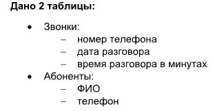

# Тестовое задание на позицию: «Разработчик Python (Junior)».

## 1 задача. Python, scraping, PostgreSQL:

- Извлечь данные с сайта https://nedradv.ru/nedradv/ru/auction и сохранить их в базе данных PostgreSql:
    - Требования к данным:
        - Дата
        - Участок
        - Регион
        - Статус
        - Срок подачи заявок
        - Взнос за участие в аукционе
        - Организатор
- Создайть схему БД с необходимыми таблицами и полями для хранения извлечённых данных.
- Написать скрипт для вставки данных в БД (убедитесь, что скрипт обрабатывает ошибки и исключения, которые могут возникнуть в процессе вставки данных).
- Протестировать парсер на нескольких страницах сайта, чтобы убедиться, что он может обрабатывать различные форматы и макеты.
- Сформировать краткий отчёт с описанием предпринятых шагов и проблем, возникших в процессе выполнения задания.

Результат выполнения задания: скрипт для извлечения с сайта и вставки в БД PostgreSql указанных данных, краткий отчёт о выполненном задании.

Дополнительно (необязательно):
Оптимизируйте парсер для сокращения времени извлечения данных и добавьте в отчёт предпринятые шаги и проблемы, с которыми столкнулись при оптимизации.

## 2 задача. SQL

Дано 2 таблицы:

- Сформировать SQL-запросы, позволяющие получить:
    - Список, содержащий ФИО и время разговора по суткам
    - Список звонков, где время разговора за сутки больше 5 минут
    - Список звонков, где перерывы между звонками не более 5 минут
    - Список, содержащий информацию по абонентам:
        - количество звонков в день
        - средняя и медиана разговора в минутах
        - размах по времени разговора

## Установка и запуск проекта
